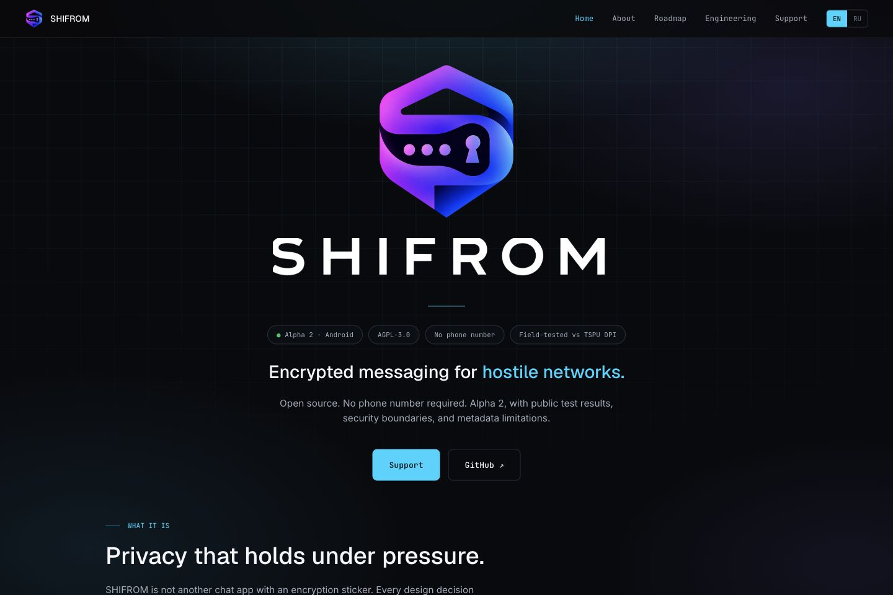
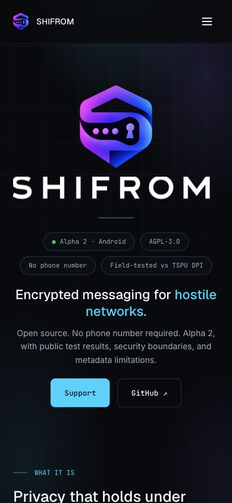

# SHIFROM Website Review

I refreshed the existing bilingual website after the product's naming conflict and the transition to SHIFROM. This change prepares repository files for review; it does not deploy the website.

## Visual Review

The homepage keeps the former centered composition with the approved SHIFROM mark, separate wordmark, divider and four badges. The approved social image is separate from the live page and is copied without alteration.

| Desktop | Mobile |
| --- | --- |
|  |  |

I checked both homepages at 1440 x 960, 1366 x 768, 1920 x 1080, 390 x 844 and 320 x 740. Fonts and artwork load; hero content stays within the viewport, and the next section remains visible. These are responsive reference checks, not pixel-identical reproduction of an old screenshot with unknown browser zoom.

## Donation-Link Audit

Checked on 8 October 2026. Opening a public profile does not prove that a payment or payout will succeed; neither was attempted.

| Destination | Observed state | Next step |
| --- | --- | --- |
| [Liberapay](https://liberapay.com/Phantom-messenger/) | Public profile still uses the previous name and description. | Update account branding and verify the resulting URL before replacing links. Username-change availability has not been confirmed for this account. |
| [Buy Me a Coffee](https://buymeacoffee.com/phantompro) | Public support page still uses the previous name and description. | Rebrand the existing account and check the new link. A replacement account is not necessarily required. |
| GitHub Sponsors | Existing `LiudvigVladislav` destination is retained. | Independently verify account and payout status before making an availability claim. |
| BTC, XMR and USDT ERC-20 addresses | EN/RU page values remain byte-identical to the prior repository version. | Keep current values until any replacement is verified. This comparison is not proof of key ownership or transaction capability. |

Buy Me a Coffee's [official setup guide](https://help.buymeacoffee.com/en/articles/10184401-how-to-set-up-your-buy-me-a-coffee-page) documents changing the URL through Settings -> My Page Link and updating previously shared links. Its [advanced-settings guide](https://help.buymeacoffee.com/en/articles/10202407-buy-me-a-coffee-advanced-settings-explained) explicitly covers rebranding the page URL. I have not changed either account.

The two public profiles also carry older product-readiness and security descriptions. Those need a factual review during account rebranding, not only a name replacement.

## Migration Boundary

I preserved the previous donation URLs, GitHub funding configuration, `funding.json`, its well-known pointer, existing cryptocurrency addresses and the Codeberg mirror link. Legacy URLs are deliberate compatibility exceptions, not the current product name.

After replacement destinations are verified, update the EN/RU support pages and all funding references together. Do not replace an old handle with an assumed SHIFROM handle: an existing URL can belong to someone else. Do not treat a product rename as a reason to discard wallet keys or move funds.

Application identity, signing, user data, relay hosts, legal pages, deployment configuration and historical article slugs are outside this website change. Publication requires a separate bounded verification of the running site's mounts and cache behavior without restarting relay.
